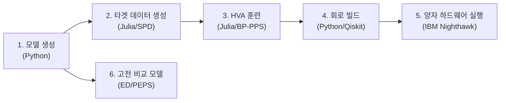

# Spin Glass QML — 실행 매뉴얼

4×4 2D Spin Glass 모델의 양자 시뮬레이션 파이프라인 전체 가이드.

---

## 전체 파이프라인 개요



| 단계 | 환경 | 도구 | 출력 |
|:---|:---|:---|:---|
| 1. 모델 생성 | Desktop | Python | `model_config.json` |
| 2. 타겟 SPO 생성 | Desktop (RTX 2060) | Julia + PauliPropagation.jl | `targets_dt0.5.json` |
| 3. HVA 파라미터 훈련 | Desktop | Julia + Zygote AD | `trained_params.json` |
| 4. 회로 빌드 | Desktop | Python + Qiskit | HVA/Trotter 회로 |
| 5. 양자 실행 | Cloud | IBM Qiskit Runtime | 샘플링 결과 |
| 6. 고전 비교 | Desktop | Python (ED) | 기댓값, 에너지 |

---

## 0. 환경 설정

### Python 환경
```bash
cd /home/hyunwoo/workspace/spin-glass-qml
source .venv/bin/activate

# 필요 패키지 (이미 설치됨)
pip install qiskit qiskit-ibm-runtime numpy scipy torch
```

### Julia 환경
```bash
# Julia 설치 (아직 안 되어 있다면)
curl -fsSL https://install.julialang.org | sh

# 프로젝트 의존성 설치
cd /home/hyunwoo/workspace/spin-glass-qml
julia --project=julia -e 'using Pkg; Pkg.instantiate()'
```

> [!IMPORTANT]
> PauliPropagation.jl이 Julia 레지스트리에 없을 경우:
> ```julia
> using Pkg
> Pkg.add(url="https://github.com/MSRudolph/PauliPropagation.jl")
> ```

---

## 1. 모델 생성

4×4 EA bimodal spin glass 모델 (seed=42, h=1.0).

```bash
python -c "
import sys; sys.path.insert(0, 'src')
from hamiltonians import SpinGlass2D
import json

model = SpinGlass2D(Lx=4, Ly=4, h=1.0, coupling_type='ea_bimodal', seed=42)
config = {
    'Lx': 4, 'Ly': 4, 'h': 1.0, 'seed': 42,
    'J': model.J.tolist(),
    'bonds': model.bonds,
    'num_qubits': model.num_qubits,
    'num_bonds': model.num_bonds,
}
import os; os.makedirs('results/4x4', exist_ok=True)
with open('results/4x4/model_config.json', 'w') as f:
    json.dump(config, f, indent=2)
print(f'Model saved: {model.num_qubits}q, {model.num_bonds} bonds')
"
```

### 모델 검증
| 속성 | 값 |
|:---|:---|
| 큐비트 수 | 16 |
| 본드 수 | 24 (수평 12 + 수직 12) |
| 커플링 | J ∈ {+1, -1} (EA bimodal) |
| 횡자기장 | h = 1.0 |
| 격자 | Open boundary square lattice |

---

## 2. 타겟 데이터 생성 (Julia SPD)

정밀 Trotter 회로 (4차 Suzuki-Trotter, dt=0.001, cutoff=1e-8)를 통해 local observable을
파울리 전파하여 타겟 SPO를 생성합니다. 이 파라미터는 BP-PPS 논문과 동일합니다.

$$\tilde{X}_i(\Delta t) = V^\dagger X_i V = \sum_P \tilde{a}_P P$$

여기서 $V = \text{Trotter}_{S_4}(\Delta t, dt=0.001)$.

```bash
julia --project=julia julia/scripts/train_4x4.jl
```

### 주요 파라미터

| 파라미터 | 값 | 설명 |
|:---|:---|:---|
| Δt | 0.5 | 시간 청크 (composition용) |
| dt_fine | 0.001 | 타겟 Trotter 정밀도 (논문: 0.001) |
| cutoff_target | 1e-8 | 타겟 SPO 절단 임계값 (논문: 1e-8) |
| Trotter order | 4 | 4차 Suzuki-Trotter (논문: 4차) |

### 출력 파일
- `results/4x4/targets_dt0.5.json` — 32개 observable (X_1~X_16, Z_1~Z_16)의 SPO

### 예상 소요 시간 (RTX 2060 데스크톱)

| 항목 | 게이트 수 | 예상 시간 |
|:---|:---|:---|
| 타겟 1개 생성 | 140,000 | ~5-15분 |
| 32개 전체 (직렬) | 4,480,000 | ~2-8시간 |
| 32개 전체 (8코어 병렬) | — | ~20-60분 |

> [!TIP]
> 각 observable은 독립적이므로 Julia의 `Threads.@threads` 로 병렬화 가능.

---

## 3. HVA 파라미터 훈련 (Julia BP-PPS)

2단계에서 생성된 타겟 SPO와 HVA 회로의 SPO 차이를 최소화합니다.

$$\mathcal{L}_{X,Z} = \sum_{G \in \{X_i, Z_i\}} \sum_P \left(a_P^{(\text{HVA})} - \tilde{a}_P^{(\text{target})}\right)^2$$

Gradient는 **BP-PPS 역전파 (Eq. 20-21)**로 계산됩니다.
Zygote AD가 아닌 역게이트 재구성 알고리즘으로, 메모리 $O(N_P)$ 만 사용합니다.

```bash
# 2단계와 함께 실행됨 (train_4x4.jl에 포함)
julia --project=julia julia/scripts/train_4x4.jl
```

### 훈련 설정

| 파라미터 | 값 | 설명 |
|:---|:---|:---|
| HVA layers | 3 | RX + RZZ × 4 substeps = depth 15 |
| 파라미터 수 | 120 | 3 × (16 + 24) |
| Optimizer | Adam | lr=0.01, β₁=0.9, β₂=0.999 |
| cutoff_train | 1e-4 | 훈련 중 SPO 절단 |
| Epochs | 200 | |
| Gradient | BP-PPS Eq. 20-21 | O(N_P) 메모리 |

### 출력 파일
- `results/4x4/trained_params.json` — 최적화된 120개 파라미터
- `results/4x4/gs_trained_params.json` — 바닥상태 훈련 파라미터

### 예상 소요 시간 (RTX 2060 데스크톱)
- 시간진화: ~1-5분 (200 epochs, HVA 120 gates/fwd+bwd)
- 바닥상태: ~1-3분 (100 epochs)

> [!NOTE]
> 훈련은 타겟 생성보다 훨씬 빠릅니다. HVA는 120 gates밖에 안 되고
> cutoff=1e-4로 SPO 크기도 작습니다.

---

## 4. 양자 회로 빌드 (Python/Qiskit)

훈련된 파라미터로 Qiskit 회로를 구성합니다.

```bash
python scripts/01_build_hw_circuits.py
```

### 생성되는 회로

#### HVA 회로 (훈련된 U(θ; Δt))
- 깊이: ~15 (3 layers × 5 steps)
- 2큐비트 게이트: 72 (3 layers × 24 bonds)
- T=k·Δt 시뮬레이션: HVA를 k번 반복 (depth = 15k)

#### Trotter 회로 (비교용)
- dt=0.1: depth ~30/step
- dt=0.2: depth ~12/step (정확도 낮음)

### 시간 확장 (Composition)

$$U(\theta; T) = U(\theta; \Delta t)^{T/\Delta t}$$

| T | 반복 수 | HVA depth | Trotter depth (dt=0.1) |
|:---|:---|:---|:---|
| 0.5 | 1 | 15 | 30 |
| 1.0 | 2 | 30 | 60 |
| 1.5 | 3 | 45 | 90 |
| 2.0 | 4 | 60 | 120 |
| 2.5 | 5 | 75 | 150 ← 하드웨어 한계 |

---

## 5. 양자 하드웨어 실행 (IBM Nighthawk)

### 5-1. IBM 연결 설정

```python
from qiskit_ibm_runtime import QiskitRuntimeService

# 최초 1회 저장
QiskitRuntimeService.save_account(
    channel="ibm_cloud",
    token="YOUR_API_TOKEN",
    instance="YOUR_CRN",
    overwrite=True,
)

service = QiskitRuntimeService()
backend = service.least_busy(min_num_qubits=16)
print(f"Backend: {backend.name}")
```

### 5-2. 트랜스파일 및 실행

```python
from qiskit.transpiler.preset_passmanagers import generate_preset_pass_manager
from qiskit_ibm_runtime import SamplerV2

# Transpile to target backend
pm = generate_preset_pass_manager(
    optimization_level=3,
    backend=backend,
)

# HVA circuit
qc_hva = ...  # from Step 4
isa_hva = pm.run(qc_hva)
print(f"Transpiled HVA depth: {isa_hva.depth()}")

# Trotter circuit
qc_trotter = ...  # from Step 4
isa_trotter = pm.run(qc_trotter)

# Run sampling
sampler = SamplerV2(backend)
job_hva = sampler.run([isa_hva], shots=10000)
job_trotter = sampler.run([isa_trotter], shots=10000)

# Get results
result_hva = job_hva.result()
result_trotter = job_trotter.result()

counts_hva = result_hva[0].data.meas.get_counts()
counts_trotter = result_trotter[0].data.meas.get_counts()
```

### 5-3. 결과 분석

```python
import numpy as np

def counts_to_expectations(counts, n_qubits, n_shots):
    """샘플링 결과에서 ⟨Z_i⟩, ⟨X_i⟩ 추정."""
    # Z_i expectation
    z_exp = np.zeros(n_qubits)
    for bitstring, count in counts.items():
        for i in range(n_qubits):
            bit = int(bitstring[-(i+1)])  # Qiskit little-endian
            z_exp[i] += (1 - 2*bit) * count
    z_exp /= n_shots
    return z_exp

z_hva = counts_to_expectations(counts_hva, 16, 10000)
z_trotter = counts_to_expectations(counts_trotter, 16, 10000)
```

> [!NOTE]
> X_i 기댓값은 직접 측정 불가 — Hadamard 기저 변환 후 Z 측정이 필요합니다.
> ```python
> qc_x = qc_hva.copy()
> qc_x.remove_final_measurements()
> for q in range(16):
>     qc_x.h(q)
> qc_x.measure_all()
> ```

---

## 6. 고전 비교 모델

### 6-1. Exact Diagonalization (4×4 가능)

```python
import sys; sys.path.insert(0, 'src')
from hamiltonians import SpinGlass2D
from classical_bench import ExactDiag
import numpy as np

model = SpinGlass2D(Lx=4, Ly=4, h=1.0, coupling_type='ea_bimodal', seed=42)
H = model.build_sparse_matrix()
ed = ExactDiag(H, model.num_qubits)

# 바닥 에너지
E0 = ed.ground_energy()
print(f"E0 = {E0}")

# 시간 진화 (|0...0⟩ 초기 상태)
psi0 = np.zeros(2**16)
psi0[0] = 1.0
psi_t = ed.time_evolve(psi0, t=0.5)

# Local observables
obs = ed.local_observables(psi_t, model.bonds)
print(f"<X_0>(t=0.5) = {obs['X'][0]:.6f}")
print(f"<Z_0>(t=0.5) = {obs['Z'][0]:.6f}")
```

> [!WARNING]
> ED는 4×4 (16큐비트)까지만 실행 가능합니다.
> 22큐비트 이상은 메모리 초과로 차단됩니다.

### 6-2. 결과 비교 방법

| 비교 항목 | HVA (양자) | Trotter (양자) | ED (고전 정답) |
|:---|:---|:---|:---|
| ⟨Z_i⟩ | 샘플링 | 샘플링 | 정확한 계산 |
| ⟨X_i⟩ | H기저 샘플링 | H기저 샘플링 | 정확한 계산 |
| 에너지 | ⟨H⟩ 추정 | ⟨H⟩ 추정 | 정확한 E₀ |
| 확률분포 | bitstring counts | bitstring counts | \|ψ(t)\|² |

---

## 파일 구조

```
spin-glass-qml/
├── src/                          # Python 모듈
│   ├── hamiltonians/             # 2D spin glass Hamiltonian
│   ├── ansatz/                   # HVA + Qiskit Trotter
│   ├── classical_bench/          # Exact Diagonalization
│   └── bppps/                    # Python BP-PPS (참조 구현)
├── julia/                        # Julia 모듈 (주력 엔진)
│   ├── Project.toml              # Julia 의존성
│   ├── src/
│   │   ├── hamiltonian.jl        # 격자/커플링/게이트 시퀀스
│   │   └── trainer.jl            # BP-PPS 훈련 (Zygote AD)
│   └── scripts/
│       └── train_4x4.jl          # 4×4 훈련 실행
├── scripts/                      # Python 스크립트
│   ├── 00_validate_small.py      # 통합 테스트 (9개)
│   └── 01_build_hw_circuits.py   # 양자 회로 빌드
├── results/4x4/                  # 출력 디렉토리
│   ├── model_config.json
│   ├── targets_dt0.5.json
│   ├── trained_params.json
│   └── gs_trained_params.json
└── configs/
    └── model_2d_spinglass.yaml
```

---

## 빠른 실행 가이드

```bash
# 1. 전체 테스트 검증
python scripts/00_validate_small.py

# 2. Julia 환경 설정
julia --project=julia -e 'using Pkg; Pkg.instantiate()'

# 3. 4×4 훈련 (타겟 생성 + HVA 훈련)
julia --project=julia julia/scripts/train_4x4.jl

# 4. 양자 회로 빌드
python scripts/01_build_hw_circuits.py

# 5. 양자 하드웨어 실행 (IBM cloud 연결 필요)
python scripts/02_run_hardware.py  # 추후 작성
```

---

## 트러블슈팅

### Julia 패키지 설치 실패
```bash
# PauliPropagation.jl 수동 설치
julia --project=julia -e '
using Pkg
Pkg.add(url="https://github.com/MSRudolph/PauliPropagation.jl")
Pkg.add(["Optim", "JSON"])
'
```

### 메모리 부족 (4×4 ED)
- `build_sparse_matrix()` 대신 `get_pauli_terms()` 사용
- ED는 22큐비트 이상 자동 차단

### Zygote gradient 오류
- `min_abs_coeff` (cutoff) 값을 높여 SPO 항 수 줄이기
- `cutoff=1e-3` 으로 시작하여 수렴 후 `1e-4`로 줄이기

---

## 대규모 (100큐비트) 계산 비용 추정

### 타겟 생성 (10×10, H200×2 서버)

| 항목 | 4×4 (16q) | 10×10 (100q) |
|:---|:---|:---|
| 본드 수 | 24 | 180 |
| S₄ step 당 게이트 | 280 | 1,900 |
| Total 게이트 (500 steps) | 140,000 | 950,000 |
| Observable 수 | 32 | 200 |
| 총 게이트 적용 | 4.5M | 190M |
| SPO 항 수 (추정) | 1K-10K | 10K-1M |
| 예상 시간 (병렬) | 20-60분 | 3-7일 |
| 메모리 (per SPO) | 1-10 MB | 100MB-10GB |
| 총 메모리 | < 1 GB | < 282 GB (H200×2) |
| **실행 가능성** | ✅ RTX 2060 | ✅ H200×2 |

### 훈련 (BP-PPS backward, H200×2 서버)

| 항목 | 4×4 (16q) | 10×10 (100q) |
|:---|:---|:---|
| HVA 게이트 수 | 120 | 840 |
| SPO 항 수 (cutoff=1e-4) | 100-1K | 1K-10K |
| Epoch 시간 | ~0.1-1s | ~10-100s |
| 200 epochs | ~1-5분 | ~30분-6시간 |
| **실행 가능성** | ✅ RTX 2060 | ✅ H200×2 |

> [!WARNING]
> 100큐비트 스핀 유리는 균일한 TFI 모델보다 SPO 성장이 빠를 수 있습니다.
> 실제 실행 시 SPO 크기를 모니터링하고, 필요하면 cutoff를 높이세요.

> [!TIP]
> **최적화 전략**: 타겟 생성 시 `max_weight` 절단도 함께 사용하면
> 높은 Pauli weight의 항을 조기에 제거하여 SPO 크기를 더 억제할 수 있습니다.

