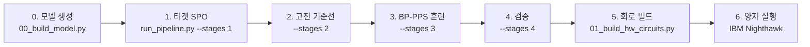

# Spin Glass QML — 실행 매뉴얼

2D 스핀 유리 모델의 BP-PPS 압축 파이프라인 전체 가이드.
격자 크기는 설정 파일로 결정되며, 아래 명령은 4×4 와 10×10 에 모두 동일하게 적용됩니다.

---

## 전체 파이프라인 개요



| 단계 | 스크립트 | 출력 |
|:---|:---|:---|
| 0. 모델 생성 | `scripts/00_build_model.py` | `model_config.json`, `run_config.json` |
| 1. 타겟 SPO | `scripts/run_pipeline.py --stages 1` | `targets_dt<Δt>.json` |
| 2. 고전 기준선 | `--stages 2` | `ed_results.json`, `trotter_results.json` |
| 3. 훈련 | `--stages 3` | `trained_params.json`, `gs_trained_params.json` |
| 4. 검증 | `--stages 4` | `validation_results.json` |
| 5. 회로 빌드 | `scripts/01_build_hw_circuits.py` | `*.qasm`, `hw_circuits.json` |
| 6. 양자 실행 | (미구현) | 샘플링 결과 |

Julia 는 1~3 단계의 선택적 고성능 대체 경로입니다.

---

## 0. 환경 설정

### Python

```bash
cd /home/hyunwoo/workspace/spin-glass-qml
source .venv/bin/activate
pip install -r requirements.txt
```

### Julia (선택)

```bash
curl -fsSL https://install.julialang.org | sh
julia --project=julia -e 'using Pkg; Pkg.instantiate()'

# PauliPropagation.jl 은 타겟 생성 가속용 선택 의존성입니다.
# General registry 에 없으므로 Project.toml 에 넣지 않았고, 없으면
# 내장 엔진(bppps_engine.jl)으로 자동 대체됩니다.
julia --project=julia -e 'using Pkg; Pkg.add(url="https://github.com/MSRudolph/PauliPropagation.jl")'
```

> [!IMPORTANT]
> 긴 작업 전에 반드시 환경 점검을 먼저 돌리세요. 수 초면 끝나고,
> 게이트 순서·gradient·PauliPropagation API 를 모두 확인합니다.
> ```bash
> julia --project=julia julia/scripts/check_env.jl
> ```

---

## 설정 파일

모든 값은 `configs/` 의 세 YAML 에서 옵니다. 스크립트 안에 하드코딩된 상수는 없습니다.

| 파일 | 내용 |
|:---|:---|
| `model_2d_spinglass.yaml` | 격자 크기, 커플링 분포, 횡자기장, seed |
| `ansatz_ibm.yaml` | HVA 층 수, 타겟 Trotter 정밀도, 하드웨어 Trotter 기준선 |
| `optimizer.yaml` | Adam / L-BFGS-B 단계, 초기화 전략, 절단 스케줄 |

명령줄에서 개별 값을 덮어쓸 수 있습니다.

```bash
python scripts/run_pipeline.py --set ansatz.n_layers=5 --set truncation.min_delta=1e-6
```

### 주요 파라미터

| 파라미터 | 기본값 | 설명 |
|:---|:---|:---|
| `target.delta_t` | 0.5 | 시간 청크. composition 으로 T = k·Δt 도달 |
| `target.dt` | 0.001 | 타겟 Trotter 스텝 (BP-PPS 논문값) |
| `target.trotter_order` | 4 | 4차 Suzuki-Trotter |
| `target.cutoff` | 1e-8 | 타겟 SPO 절단 임계값 (논문값) |
| `truncation.initial_delta` | 1e-3 | 훈련 시작 절단 임계값 |
| `truncation.min_delta` | 1e-5 | adaptive 스케줄의 하한 |
| `optimizer.init.trotter_warm_start` | true | 1차 Trotter 각도로 초기화 |

---

## 1. 모델 생성

커플링 `J` 가 생성되는 **유일한 지점**입니다. 이후 모든 단계는 Python 이든 Julia 든
여기서 나온 JSON 을 읽습니다.

```bash
python scripts/00_build_model.py
python scripts/00_build_model.py --set model.Lx=10 --set model.Ly=10
```

> [!WARNING]
> Julia 쪽에서 커플링을 다시 생성하면 안 됩니다. NumPy 의 PCG64 와 Julia 의
> MersenneTwister 는 같은 seed 에서 다른 수열을 내고, 본드 인덱스 `k` 가 가리키는
> 물리적 본드도 루프 순서에 따라 달라집니다. `load_model_config` 는 저장된 본드
> 목록을 `build_bonds` 와 대조해 불일치 시 즉시 실패합니다.

### 4×4 모델 검증값

| 속성 | 값 |
|:---|:---|
| 큐비트 수 | 16 |
| 본드 수 | 24 (수평 12 + 수직 12) |
| 커플링 | J ∈ {+1, −1}, seed=42, ΣJ = +4 |
| Frustration | 플라켓의 66.7% |
| 횡자기장 | h = 1.0 |
| 격자 | Open boundary square lattice |

---

## 2. 타겟 SPO 생성

정밀 Trotter 회로를 통해 국소 관측량을 파울리 전파합니다.

$$\tilde{X}_i(\Delta t) = V^\dagger X_i V = \sum_P \tilde{a}_P P , \qquad V = \text{Trotter}_{S_4}(\Delta t,\ dt = 0.001)$$

```bash
python scripts/run_pipeline.py --stages 1
```

> [!NOTE]
> 이 `V` 는 **하드웨어에 올릴 회로가 아니라 수치적으로 정확한 기준값**입니다.
> 압축률을 이야기할 때 비교 대상은 이것이 아니라 `hardware_trotter` 블록의
> 2차 Trotter(dt = 0.1) 회로입니다.

한 번 생성된 타겟은 캐시되어 이후 실행에서 재사용됩니다.
`targets_*.json` 은 크기 때문에 `.gitignore` 에 있으므로, 머신을 옮길 때는
직접 복사하거나 재생성해야 합니다.

### 예상 소요 시간 (4×4, RTX 2060 데스크탑, Python 엔진)

| 항목 | 게이트 수 | 시간 |
|:---|:---|:---|
| 32개 관측량 전체 | 4.5M | ~7시간 |

---

## 3. BP-PPS 훈련

### 어느 절반을 훈련할지 — `--train`

stage 3 은 서로 독립인 두 훈련으로 되어 있습니다. 시간 진화 압축은 타겟 SPO 를
쓰고, 바닥상태 준비는 해밀토니안만 씁니다.

```bash
python scripts/run_pipeline.py --stages 3 --train gs   # 바닥상태만 (타겟 캐시 불필요)
python scripts/run_pipeline.py --stages 3 --train te   # 시간 진화만
python scripts/run_pipeline.py --stages 3              # 둘 다 (기본값)
```

바닥상태 설정만 바꿨을 때 `--train gs` 를 쓰면 ~78분짜리 시간 진화 훈련을
건너뜁니다. 그리고 시간 진화를 다시 훈련하면 `trained_params.json` 이 바뀌므로
**`plot_extended.py --part 1` 을 반드시 같이 돌려야** `composition_fidelity.json`
과 그림 02·09 가 낡지 않습니다.

### 바닥상태 초기상태 — `optimizer.ground_state.initial_state`

`plus` (기본값, `|+...+>`) 또는 `zero` (`|0...0>`).

`ΠX = Π_i X_i` 는 `H` 와도 HVA 의 RX·RZZ 게이트 전부와도 교환하므로, 회로는 두
패리티 섹터 사이로 무게를 옮길 수 없습니다. 바닥상태는 **항상** `+1` 섹터에
있습니다 — `H` 가 stoquastic 이라 Perron–Frobenius 에 의해 진폭이 전부 양수이고,
`ΠX` 는 그 진폭들의 치환이라 `-ψ₀` 를 낼 수 없기 때문입니다. 계 크기와 무관하게
성립합니다.

`|+...+>` 는 그 `+1` 섹터의 고유상태이지만 `|0...0>` 은 패리티 고유상태가
아니어서 (`ΠX|0...0> = |1...1>`) 두 섹터에 정확히 반씩 갈립니다. 그래서
**`|0...0>` 에서는 바닥상태 fidelity 가 어떤 θ 로도 0.5 를 못 넘습니다.**
구현상 바뀌는 것은 에너지를 읽을 때 쓰는 필터 하나입니다 — `<s|P|s> = 1` 인
파울리 문자열이 `|0...0>` 이면 I/Z, `|+...+>` 이면 I/X 입니다
(`bppps/pauli_utils.py`의 `product_state_filter`).

```bash
python scripts/run_pipeline.py --stages 3
```

### 손실 함수

시간진화 압축 (BP-PPS Eq. 30):

$$\mathcal{L}_{X,Z} = \sum_i \lVert X_i(t) - \tilde{X}_i(t) \rVert_{\rm rHS}^2 + \sum_i \lVert Z_i(t) - \tilde{Z}_i(t) \rVert_{\rm rHS}^2 = \sum_G \sum_P (a_P - \tilde{a}_P)^2$$

바닥상태 준비:

$$E(\theta) = \langle 0 | U(\theta)^\dagger H U(\theta) | 0 \rangle = \sum_{P \in \{I,Z\}^n} a_P$$

### 알고리즘

- **Gradient**: BP-PPS Eq. 20–21 역전파. Zygote 같은 자동미분이 아니라 회로 가역성으로
  중간 SPO 를 역게이트 재구성하므로 메모리가 `O(N_P)` 입니다.
- **절단**: Eq. 21 아래 규칙대로 튜플 `(P, a_P, ∂L/∂a_P)` 를 계수 크기 하나로 통째 폐기합니다.
  adjoint 를 자기 스케일로 자르지 않으며, 역전파가 계수 support 로 자동 제한됩니다.
- **초기화**: 1차 Trotter warm start. 논문은 랜덤 초기화가 2~3층까지만 수렴한다고 보고합니다.
- **최적화**: Adam → L-BFGS-B 2단계.
- **오차 추적**: 모든 전파가 Appendix B 의 `eps_emp` 를 누적합니다 (아래 참조).

### 로그 읽는 법

```
Epoch  40/200: loss=0.942, |grad|=3.11, eps_trunc=8.3e-04, delta=1.0e-03, time=812s
```

`eps_trunc` 가 손실의 스케일에 근접하면 보고된 loss 를 그 자릿수까지 믿으면 안 됩니다.
`truncation.adaptive: true` 이면 이때 `delta` 가 자동으로 조여집니다.

---

## 4. 검증

```bash
python scripts/run_pipeline.py --stages 4
```

가장 중요한 한 줄:

```
|BP-PPS - statevector| = 0.000000   (should be <= the truncation estimate 4.7e-16)
```

BP-PPS 가 보고하는 에너지와 실제 배포될 상태 `U(θ)|0⟩` 의 statevector 에너지가
절단 오차 범위 안에서 일치해야 합니다. 벌어지면 절단이 부족하거나 어딘가에서
전파 방향이 틀린 것입니다. 22큐비트 초과에서는 statevector 검증이 불가능하므로
`eps_trunc` 가 유일한 안전망입니다.

---

## 5. 하드웨어 회로 빌드

```bash
python scripts/01_build_hw_circuits.py --repeats 1 2 3 4 5
python scripts/01_build_hw_circuits.py --basis X    # <X_i> 측정용 (Hadamard 삽입)
```

$$U(\theta; T) = U(\theta; \Delta t)^{T/\Delta t}$$

### 4×4 깊이 비교 (실측)

| T | k | HVA depth | HVA 2Q | Trotter dt=0.1 depth | Trotter 2Q | 압축비 |
|:--|:--|:--|:--|:--|:--|:--|
| 0.5 | 1 | 16 | 72 | 71 | 240 | 4.4× / 3.3× |
| 1.0 | 2 | 31 | 144 | 141 | 480 | 4.5× / 3.3× |
| 2.5 | 5 | 76 | 360 | 351 | 1200 | 4.6× / 3.3× |

깊이는 `rzz`/`rx` 수준이며 트랜스파일 전 값입니다.

---

## 6. 양자 하드웨어 실행

아직 스크립트가 없습니다. 아래는 참고용 스니펫입니다.

```python
from qiskit import qasm2
from qiskit.transpiler.preset_passmanagers import generate_preset_pass_manager
from qiskit_ibm_runtime import QiskitRuntimeService, SamplerV2

service = QiskitRuntimeService()
backend = service.least_busy(min_num_qubits=16)

qc = qasm2.load("results/4x4/hva_x1_Z.qasm")
pm = generate_preset_pass_manager(optimization_level=3, backend=backend)
isa = pm.run(qc)
print(f"transpiled depth: {isa.depth()}")

result = SamplerV2(backend).run([isa], shots=10000).result()
counts = result[0].data.meas.get_counts()
```

> [!NOTE]
> `<X_i>` 는 직접 측정할 수 없습니다. `--basis X` 로 빌드한 회로를 따로 실행하세요.

---

## Julia 경로

```bash
julia --project=julia julia/scripts/check_env.jl        # 먼저
julia --project=julia julia/scripts/train.jl results/4x4
```

`train.jl` 은 `run_config.json` 과 `model_config.json` 만 읽으므로 Python 쪽과
설정이 100% 동일합니다. `bppps_engine.jl` 은 `propagation.py` 의 1:1 포팅이며
외부 의존성이 없습니다. 결과 JSON 은 `params` 와 `optimized_params` 키를 모두 써서
Python 스크립트와 호환됩니다.

---

## 절단 오차 추정 (BP-PPS Appendix B)

SPD 는 계수가 임계값 `δ` 보다 작은 항을 버립니다. 버려진 무게를 추적하지 않으면
"loss 가 줄었다"가 진짜 개선인지 절단 인공물인지 구별할 수 없습니다.

게이트 s 에서 버려진 ℓ2 무게 (Eq. B3):

$$\epsilon_s = \Big( \sum_{P \in D_s} |a_P^{[s]}|^2 \Big)^{1/2}$$

서로 다른 게이트에서 생긴 잔차는 이후 전파에서 정렬되지 않으므로 coherent 합이 아니라
quadrature 로 누적합니다 (Eq. B16):

$$\epsilon_{\rm emp} = \Big( \sum_s \epsilon_s^2 \Big)^{1/2}$$

즉 버려진 모든 계수의 제곱합 한 개면 됩니다. 이것은 엄밀한 상한이 아닙니다 —
논문은 Cauchy–Schwarz 의 `2^(n/2)` 인자와 worst-case 정렬 가정을 모두 버립니다 —
그러나 Fig. 8 과 본 저장소의 TEST 12 에서 실제 오차를 안정적으로 상한합니다.

```
TEST 12: delta=1e-02: |dE|=1.20e-02, eps_emp=3.22e-01
         delta=1e-03: |dE|=3.23e-03, eps_emp=7.15e-02
         delta=1e-04: |dE|=2.75e-04, eps_emp=1.31e-02
         delta=1e-05: |dE|=1.67e-05, eps_emp=1.85e-03
```

### Adaptive truncation

`eps_emp` 는 계수 공간의 ℓ2 양이므로 loss 와 직접 비교하면 차원이 맞지 않습니다.
같은 단위끼리 비교합니다.

- 바닥상태: 에너지는 계수에 **선형**이므로 `|E|` 와 비교
- 시간진화: `L_XZ` 는 계수 거리의 **제곱**이므로 `sqrt(L)` 와 비교

`eps_emp > error_ratio × scale` 이 되면 `delta` 를 `factor` 배로 조입니다
(`min_delta` 하한, `patience` 에폭 간격). L-BFGS-B 단계에서는 곡률 모델이
깨지지 않도록 `delta` 를 고정합니다.

---

## 재실행 절차는 여기 없습니다

단계별 실행 절차, 소요 시간, 중단 기준, 지금 데스크탑에서 돌려야 하는 명령은
전부 **[RUNBOOK.md](RUNBOOK.md)** 에 있습니다. 예전에는 이 문서에도 "4×4 재실행
계획" 이 통째로 있었는데, RUNBOOK §2 와 같은 내용이 두 벌 있으니 한쪽만 고쳐지고
다른 쪽이 낡는 일이 반복돼 지웠습니다.

- 지금 반영해야 할 변경과 명령: [RUNBOOK.md](RUNBOOK.md) §1.5
- T1 전체 절차: [RUNBOOK.md](RUNBOOK.md) §2
- T1-T 시간 스윕: [RUNBOOK.md](RUNBOOK.md) §3
- 결과와 그림 해설: [results_4x4.md](results_4x4.md)

이 문서는 **코드와 설정의 레퍼런스**입니다 — 무엇이 어떤 파일에 있고 각
설정 키가 무엇을 하는지.

### 캐시 파일 관리

`results/4x4/targets_dt0.5.json` 은 정밀 타겟 캐시입니다. 있으면
`stage1_targets` 가 재사용하고, **없으면 조용히 재생성이 시작되어 몇 시간이
걸립니다.** 캐시가 없는 기계(예: 랩탑)에서 `--stages 1`, `--stages 3`(te 포함),
`--stages 4` 를 돌리지 마세요.

## 구현 전환점: 7×7 부터 bitpacking

**4×4 는 지금의 문자열 표현 그대로 갑니다.** 7×7 (49큐비트) 진입 전에 파울리 문자열을
비트팩킹 표현으로 전환합니다 — 파울리 하나당 2비트, `(x, z)` 두 비트마스크로 저장하고
짝 계산·교환 판정을 전부 비트 연산으로 처리합니다. 기존 문자열 엔진은 검증된 정답
오라클로 남겨 두고, 두 엔진의 SPO 가 정확히 일치하는지를 회귀 테스트로 묶습니다.

배경과 절차는 [benchmark_plan.md](benchmark_plan.md) 의 "구현 전환점" 절에 있습니다.

> [!NOTE]
> 스핀 유리는 병진 대칭성이 없어 BP-PPS 논문의 균일 TFI 보다 비용이 큽니다.
> 논문은 대칭성으로 관측량 몇 개만 계산하지만, 우리는 `2n` 개를 전부 전파해야 합니다
> (7×7: 98개, 10×10: 200개). 이것이 전환 시점을 7×7 로 잡은 이유입니다.


---

## 트러블슈팅

### 메모리 부족 / SPO 폭발
`truncation.initial_delta` 를 높이되 `eps_trunc` 로그를 함께 보세요.
`ansatz_ibm.yaml` 의 `target.cutoff` 를 완화하면 타겟 품질이 떨어집니다.

### BP-PPS 에너지와 statevector 에너지가 다르다
`eps_trunc` 와 비교하세요. 그 이상으로 벌어지면 절단 문제가 아니라 버그입니다.
`python scripts/00_validate_small.py` 의 TEST 10·11·13 이 이 상황을 잡습니다.

### Julia 에서 PauliPropagation 관련 오류
`check_env.jl` 의 [3]번 섹션이 실패해도 훈련은 내장 엔진으로 정상 동작합니다.
속도만 손해입니다.

### ED 메모리 초과
`ExactDiag` 는 22큐비트 초과를 차단합니다. `run_pipeline.py` 의 2·4 단계는
자동으로 건너뜁니다.

---

## 대규모 (100큐비트) 계산 비용 추정

### 타겟 생성 (10×10, H200×2 서버)

| 항목 | 4×4 (16q) | 10×10 (100q) |
|:---|:---|:---|
| 본드 수 | 24 | 180 |
| S₄ step 당 게이트 | 280 | 1,900 |
| Total 게이트 (500 steps) | 140,000 | 950,000 |
| Observable 수 | 32 | 200 |
| 총 게이트 적용 | 4.5M | 190M |
| SPO 항 수 (추정) | 1K–300K | 10K–1M |
| 예상 시간 (병렬) | ~7시간 | 3–7일 |
| 총 메모리 | < 1 GB | < 282 GB (H200×2) |

### 훈련

| 항목 | 4×4 (16q) | 10×10 (100q) |
|:---|:---|:---|
| HVA 게이트 수 | 120 | 840 |
| SPO 항 수 (δ=1e-4) | 800–18K | 10K–100K |
| 200 epochs | ~30분 | 수 시간–하루 |

> [!WARNING]
> 100큐비트에서는 statevector 검증이 불가능합니다. `eps_trunc` 를 모든 실행에서
> 기록하고, 보고하는 모든 수치에 그 값을 오차막대로 붙이세요.

> [!TIP]
> 타겟 생성 시 `max_weight` 절단을 함께 쓰면 높은 Pauli weight 항을 조기에 제거해
> SPO 크기를 더 억제할 수 있습니다 (미구현).
