# 4×4 Spin Glass QML Simulation Results

This directory contains the simulation outputs, exact diagonalization benchmarks, variational training data, and figures for the 4×4 (16-qubit) Edwards-Anderson bimodal spin glass model ($H = -\sum_{\langle i,j \rangle} J_{ij} Z_i Z_j - h \sum_i X_i$).

## Overview of Figures

| Figure | Description |
|:---|:---|
| 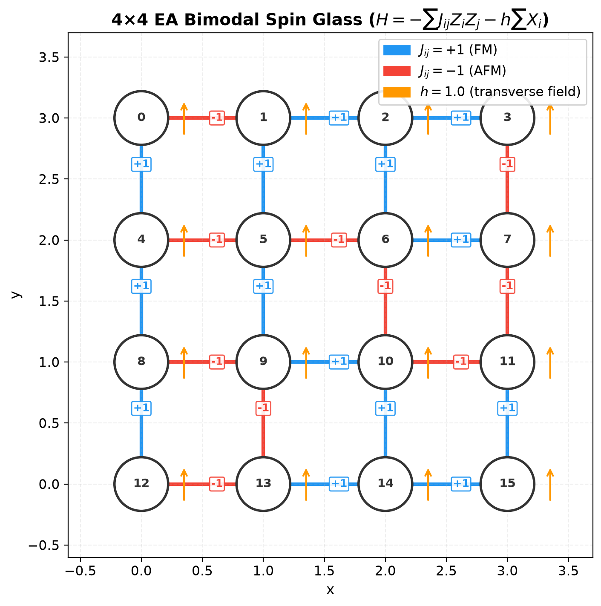 | **Lattice Structure**: $4\times 4$ grid with $J_{ij} = \pm 1$ couplings and transverse field $h=1.0$. |
| 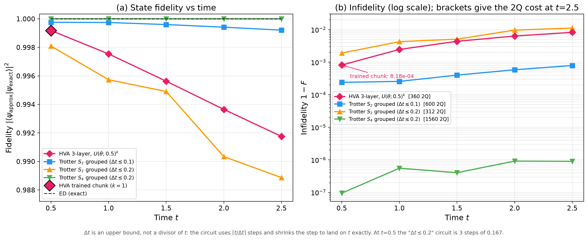 | **Fidelity Comparison**: State fidelity of Exact, Trotter ($S_2, \Delta t=0.1, 0.2$), and HVA. |
| 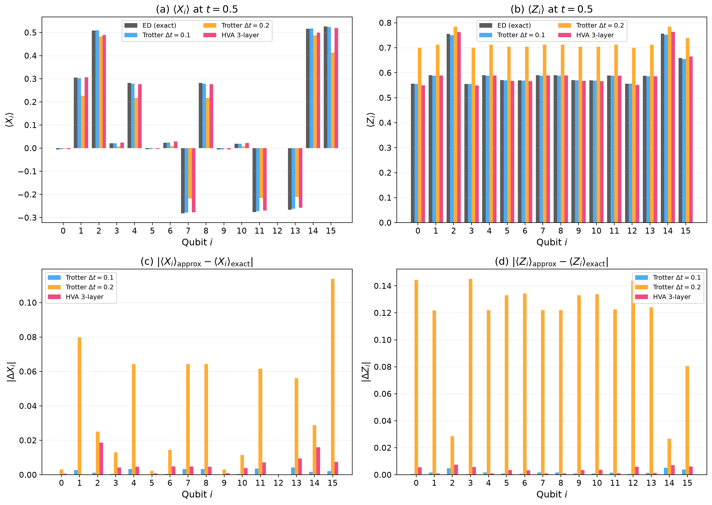 | **Local Observables**: $\langle X_i \rangle, \langle Z_i \rangle$ at $t=0.5$ and deviation $|\Delta|$. |
| 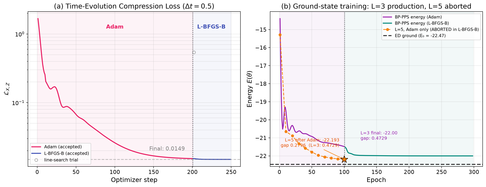 | **Training Curves**: Time-evolution loss (99.9% reduction) and ground state energy minimization. |
| 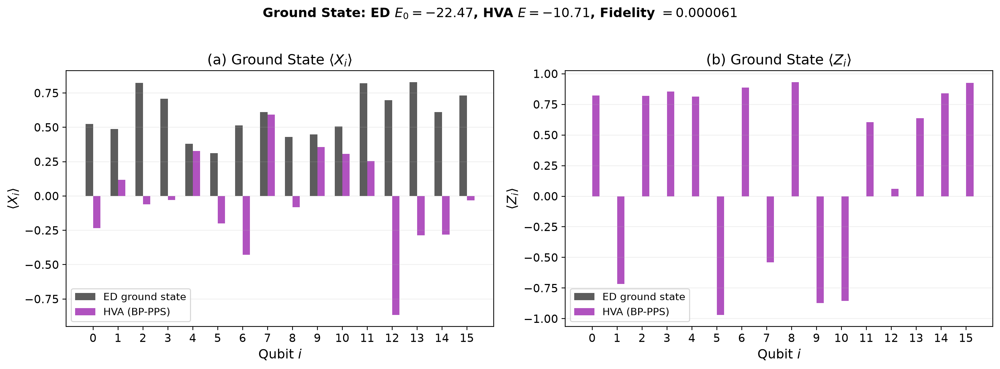 | **Ground State Observables**: Comparison between ED and variational HVA. |
| 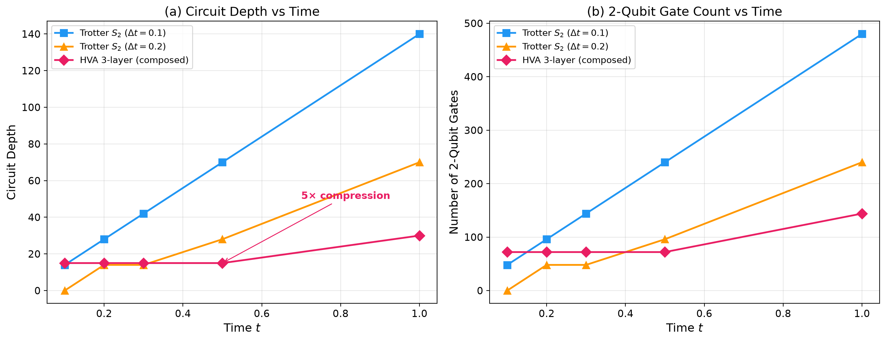 | **Circuit Depth & 2Q Gate Count**: HVA vs Trotter circuits. |
| 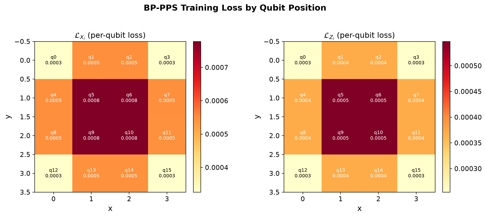 | **Loss Heatmap**: Per-qubit training error distribution across the lattice. |
| 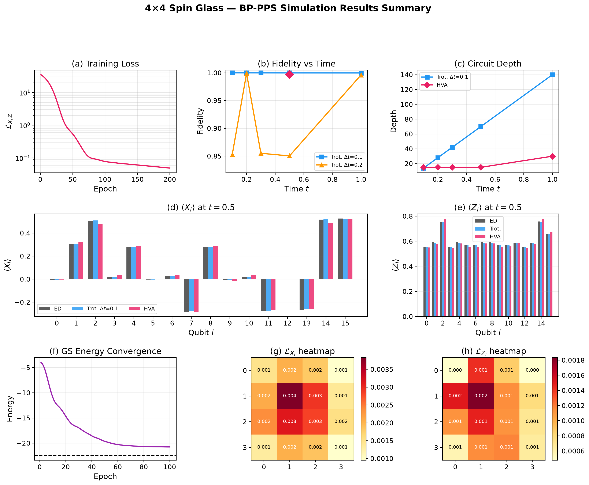 | **Summary Panel**: Multi-panel summary in BP-PPS paper style. |
| 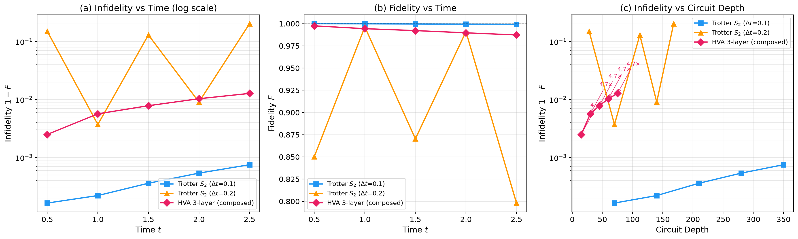 | **Composition Fidelity**: Long-time evolution ($t=0.5 \sim 2.5$) via repeated HVA blocks (log scale). |
| 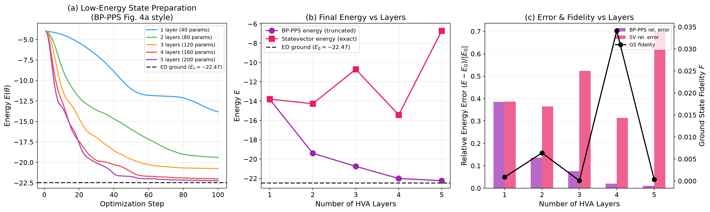 | **Low-Energy Preparation vs Layers**: Energy convergence for 1 to 5 HVA layers (BP-PPS Fig. 4a style). |
| 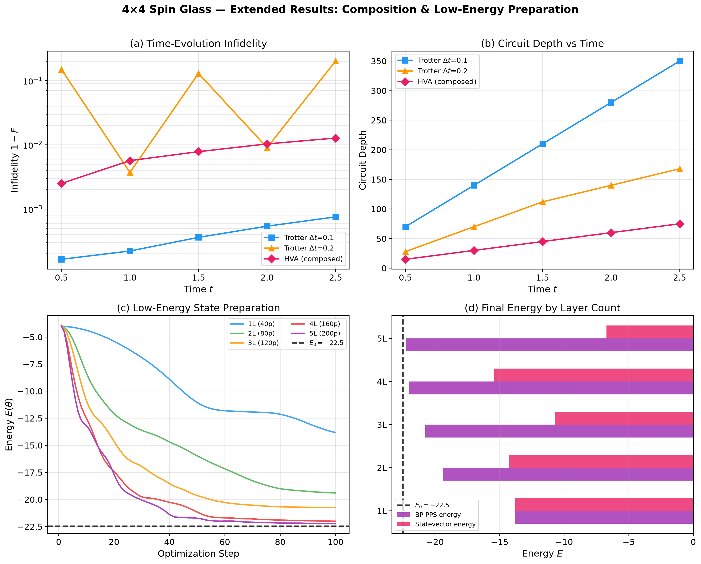 | **Extended Summary**: Combined view of composition and multi-layer state preparation. |

## Data Files

- `model_config.json`: Lattice parameters, coupling values, and run configuration.
- `ed_results.json`: Exact Diagonalization ground state and time evolution benchmarks.
- `trotter_results.json`: Trotterized quantum circuit simulation benchmarks ($\Delta t=0.1, 0.2$).
- `trained_params.json`: Optimized HVA parameters and loss history for time evolution ($\Delta t=0.5$).
- `gs_trained_params.json`: Ground state preparation parameters (3 layers).
- `gs_multi_layer.json`: Low-energy state preparation data across 1, 2, 3, 4, 5 layers.
- `composition_fidelity.json`: Fidelity and depth evaluations for composed HVA blocks at $t \in [0.5, 2.5]$.
- `validation_results.json`: Summary validation metrics comparing HVA against exact diagonalization.

## Documentation

- [Detailed Simulation Walkthrough](../../docs/walkthrough_4x4.md)
- [Visualization Analysis Report](../../docs/visualization_results.md)
- [Extended Visualization & Truncation Bias Report](../../docs/extended_visualization.md)
