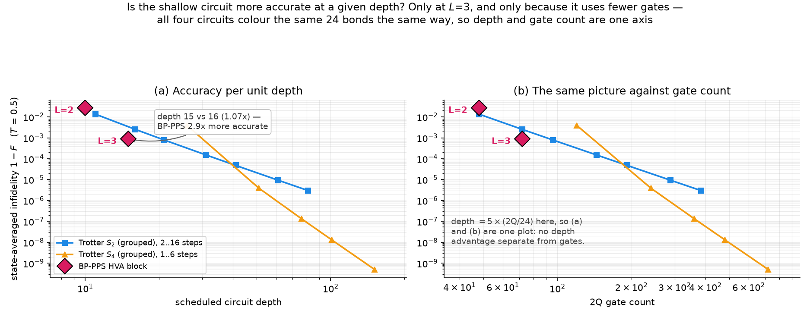
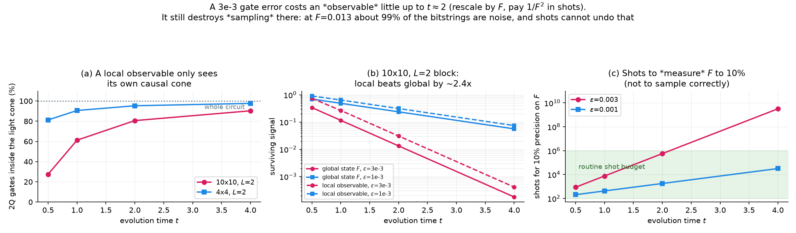

# 4×4 Spin Glass QML Simulation Results

This directory contains the simulation outputs, exact diagonalization benchmarks, variational training data, and figures for the 4×4 (16-qubit) Edwards-Anderson bimodal spin glass model ($H = -\sum_{\langle i,j \rangle} J_{ij} Z_i Z_j - h \sum_i X_i$).

> [!NOTE]
> **State as of 2026-09-03.** Everything here is from the post-fix code
> (gate ordering, `e9c3b50`; Trotter step rounding, `a0f3374`).
>
> | Check | Result |
> |:---|:---|
> | Time evolution ($t=0.5$) fidelity vs ED | 0.99918 |
> | Ground state (3 layers, from `\|+...+>`) | $E=-21.9993$, gap to $E_0$ 0.4729 |
> | Ground state `\|BP-PPS - statevector\|` | 5e-6 (truncation estimate 1.43e-3) |
> | `scripts/00_validate_small.py` | must print ALL 21 TESTS PASSED |
>
> Both of the gaps this note used to list are closed. The ground state is now
> trained from `|+...+>` (the parity of $\prod_i X_i$ caps `|0...0>` at
> fidelity 0.5), and the adaptive truncation now actually fires, so BP-PPS
> lands on the statevector optimum of its own ansatz to 5e-6. The residual
> 0.4729 gap to $E_0$ is the **3-layer ansatz**, not the training: the aborted
> $L=5$ run reaches 0.2796. See [RUNBOOK §2](../../docs/RUNBOOK.md) for the
> commands and
> [issues/01-scale-plan.md](../../docs/issues/01-scale-plan.md) for the
> evidence.
>
> `targets_dt0.5.json` was **not regenerated**; `scripts/00_verify_targets.py`
> reports a ~4e-6 MISMATCH against it because the same fix made truncation
> apply uniformly to commuting-branch coefficients. The deviation is far below
> what this run resolves, so it was kept rather than spending the ~7h
> regeneration (owner's decision, 2026-08-29).

## Overview of Figures

| Figure | Description |
|:---|:---|
|  | **Lattice Structure**: $4\times 4$ grid with $J_{ij} = \pm 1$ couplings and transverse field $h=1.0$. |
|  | **Fidelity vs time**: HVA against grouped Trotter $S_2$ ($\Delta t \leq 0.1, 0.2$) and $S_4$ ($\Delta t \leq 0.2$), all on one grid. Redrawn 2026-09-03: the Trotter curves used to come from `trotter_results.json`, i.e. qiskit's generic Suzuki synthesis, which spends 2x the RZZ of the repo's own grouped builder for the same formula. $S_4$ is new, and every legend entry carries its 2Q cost because $S_4$ reaches $1-F\sim$1e-7 for 5x the gates. |
|  | **Training Curves**: time-evolution loss (99.9% reduction) and ground-state energy minimisation. Panel (b) now overlays the aborted $L=5$ run (`gs_L5_aborted.json`): gap to $E_0$ falls 0.4729 → 0.2796, so the residual gap at $L=3$ is the ansatz, not the optimiser. |
|  | **Circuit cost and what it buys**: HVA vs grouped Trotter, both counted analytically before transpilation. Redrawn 2026-08-31 — the old version compared HVA's analytic depth against qiskit's unsorted `qc.depth()` and its double-emitted RZZ, inflating Trotter by 2.0x on gates and 2.6x on depth. Revised 2026-09-03: $S_4$ added, and panel (c) is now accuracy against 2Q count at fixed $t$=0.5 (it used to be accuracy against time, which merely redrew figure 2(b)). |
|  | **Accuracy per unit depth** at $T$=0.5, 1.0 and 2.0, averaged over 24 Haar-random product states rather than scored on $\|0\ldots0\rangle$. BP-PPS $L$=3 wins at all three (2.86x / 1.23x / 1.20x at matched gate count); on $\|0\ldots0\rangle$ Trotter wins at $T\geq$1.0, because BP-PPS degrades 1.03-1.07x off that state while grouped Trotter degrades 1.58-1.73x. Replaces `report_depth_audit.png` (2026-09-03), whose bar panel compared a 72-gate circuit against a 240-gate one under two different depth conventions and could not be read. Panel (b) repeats it against gate count: the two have the same shape, because every circuit here obeys depth $=5\times$(2Q$/24$), so depth is not a second axis. |
|  | **Noise budget by what you measure**: light-cone gate counts, global vs local signal, and the shots needed for 10% precision. Sampling at $\epsilon$=3e-3 is limited by spoofing, not shot noise, up to $t\approx$2. |

> [!NOTE]
> **Figures 3, 5, 7, 8 and 9 were removed on 2026-09-03**, along with the code
> that drew them. 3 (per-site $\langle X_i\rangle$/$\langle Z_i\rangle$),
> 5 (ground-state observables) and 7 (per-qubit loss heatmap) restated
> scalars that `docs/results_4x4.md` already gives in full, and 8 was a
> montage of the other panels. 9 was the worst case: its (a) and (b) redrew
> figure 2 from the same JSON, and its (c) plotted infidelity against
> `composition_fidelity.json`'s `*_depth` fields — the withdrawn qiskit
> depths — annotated with the 4.7x "compression" that
> [issues/05-writing.md](../../docs/issues/05-writing.md) forbids quoting.
> Every number those figures carried survives in
> [docs/results_4x4.md](../../docs/results_4x4.md); only the pictures went.

## Data Files

- `model_config.json`: Lattice parameters, coupling values, and run configuration.
- `ed_results.json`: Exact Diagonalization ground state and time evolution benchmarks.
- `trotter_results.json`: Trotter benchmarks ($\Delta t=0.1, 0.2$) built by **qiskit's generic Suzuki synthesis**, which emits $2\times$ the RZZ of the repo's grouped builder for the same formula. **No figure reads this any more** (2026-09-03); figures 2 and 6 build their own grouped circuits. Kept as the record of the qiskit-side numbers.
- `trained_params.json`: Optimized HVA parameters and loss history for time evolution ($\Delta t=0.5$).
- `gs_trained_params.json`: ground-state preparation parameters (3 layers, from `|+...+>`).
- `gs_L5_aborted.json`: the 41 h $L=5$ ground-state run, aborted inside L-BFGS-B. Energies only — `params: null`, because the angles were discarded with the abort. Plotted on figure 4(b); never deployable.
- `gs_multi_layer.PRE-FIX.json`: layer sweep (1-5) from **before** the gate-ordering fix. Kept for the trend only - do not quote the numbers. `plot_extended.py --part 2` regenerates it.
- `composition_fidelity.json`: fidelity and depth evaluations for composed HVA blocks at $t \in [0.5, 2.5]$. Figures 2 and 6 both read it, and both now recompute their Trotter curves rather than using the `trot*_fid` / `*_depth` fields it stores. Regenerate with `plot_extended.py --part 1` after any retraining.
- `validation_results.json`: Summary validation metrics comparing HVA against exact diagonalization.
- `depth_audit.json`: depth and 2Q count of HVA / grouped $S_2$ / grouped $S_4$ under one ASAP scheduler (`scripts/03f_depth_audit.py`).
- `lightcone_budget.json`: 2Q gates inside the backward light cone of a single-site observable, with global/local survival and XEB shot counts (`scripts/03g_lightcone_budget.py`).
- `sampling_hardness.json`: collision probability $Z$ and half-cut entanglement of $U(\theta;0.5)^k$.
- `statevector_pilot.json`: exact-statevector optima for the HVA plus grouped Trotter baselines. **The `time_evolution` half is scored on `|0...0>` alone and its angles were fitted to that one state** (withdrawn by `a45a88a`); do not quote layer counts or scaling from it. The `ground_state` half is unaffected — energy is not a single-state quantity.
- `state_averaged.json`, `state_averaged_T1.0.json`, `state_averaged_T2.0.json`: infidelity of every circuit averaged over 24 Haar-random product states at $T$=0.5, 1.0, 2.0 (`scripts/03g_state_averaged.py --T ...`). This is the metric CLAUDE.md's "arbitrary product state" wording calls for; the `|0...0>` column is kept alongside so the two can be reported together.
- `gs_adiabatic.json`: Trotterised adiabatic ground-state sweep, linear schedule, best anneal time per gate budget. **768 2Q is the last row, not an interior point** — goal 3's comparison is "beats the deepest anneal measured".

## Documentation

- [Results and figures, annotated](../../docs/results_4x4.md)
- [RUNBOOK — how to run this](../../docs/RUNBOOK.md)
- [Code and config reference](../../docs/manual.md)
